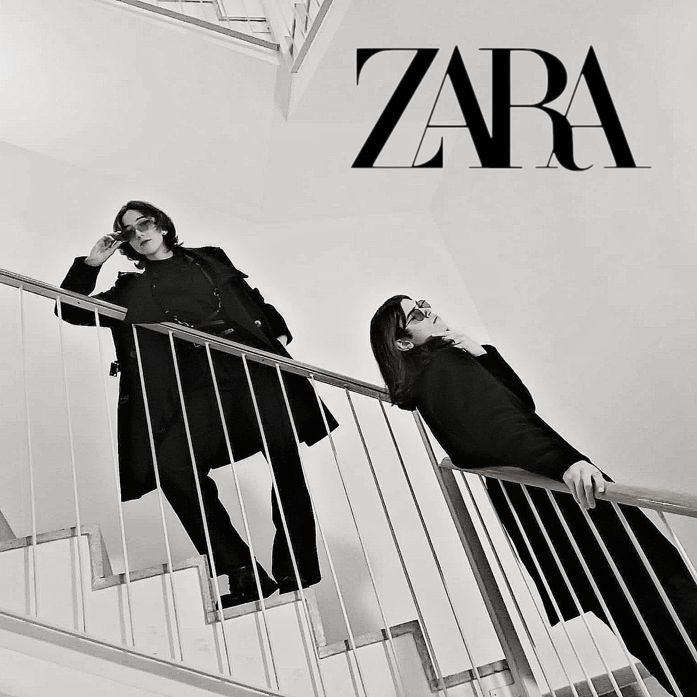
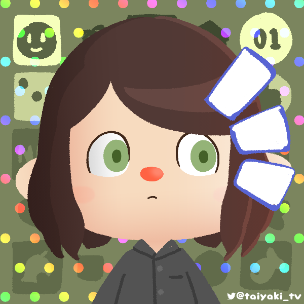
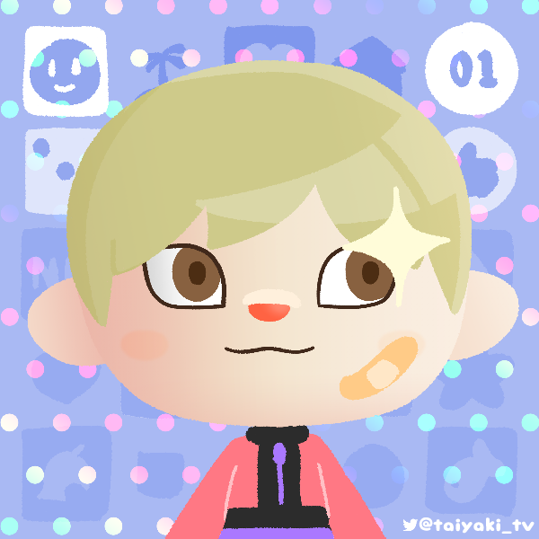

# Our project
We have replicated the game The Goonies from 1986, developed by Konami for the Family Computer as a tribute to the game. This project has been done thanks to the contributions and hard work of the members from EEPYgames, which are students of the UPC, CITM - Barcelona (Catalonia, Spain).

# About the game
The Goonies is a 1986 platform game based on the film of the same name produced by Konami for the Family Computer in Japan, and also for the MSX home computer, even though The Goonies for the MSX in 1986 offers a distinct experience compared to the NES version.

The MSX version is known for its difficulty. You only get one life, though passwords are provided between stages to help with progress. The graphics are a bit simpler compared to the NES, but the music is still catchy and the gameplay holds its own as a challenging and rewarding platformer.

Unlike the NES game where you control Mikey, the MSX version puts you in the shoes of Sloth (the Fratelli brother with a heart of gold). The game features five vast, non-linear stages, each consisting of 25 interconnected screens. This allows for more freedom in exploration compared to the NES's more linear levels.Sloth punches his way through enemies like bats and skulls. He can also collect items to aid his progress. A key twist is that you need to rescue all seven Goonies in each stage, making them significantly longer than the NES stages where you only save one per level. Keys replace bombs as the method to open doors, but you can only carry one key at a time, adding a strategic element.

# EEPY Games - Our team


## Team members
[](https://git.io/typing-svg)
* Managment
* Code
* QA
* Github: [Wakiren](https://github.com/Wakiren)
* Gmail: fjp958@gmail.com



[](https://git.io/typing-svg)
* Management
* Code
* Art/Design
* Github: [aria00015](https://github.com/aria00015)
* Gmail: albafh15@gmail.com



_Want to contact us?_
You can send us an E-mail at:

* eepy.cat.games@gmail.com

Or contact us via personal E-mail. Thanks!

# Gameplay
<iframe width="740" height="590" src="https://youtu.be/-eMC8Mv9sJ4" frameborder="0" allowfullscreen></iframe>

# Controls

```

You will have to collect keys to open doors while rescuing your siblings! "But how do you do that?" you may ask. With these controls!

- "Left" arrow: Go left
- "Rigth" arrow: Go rigth
- "Up" arrow: Climb up
- "Down" arrow: Climb down
- Space bar: Jump
- "Ctrl": Attack

```


### For more information see our wiki page [HERE](https://github.com/EEPYgames/The_Goonies-Project_I/wiki)
### Download the last version of the game [HERE]()
### Check our Github repository [HERE](https://github.com/EEPYgames/The_Goonies-Project_I)


#### _Tribute by EEPY Games Studios_